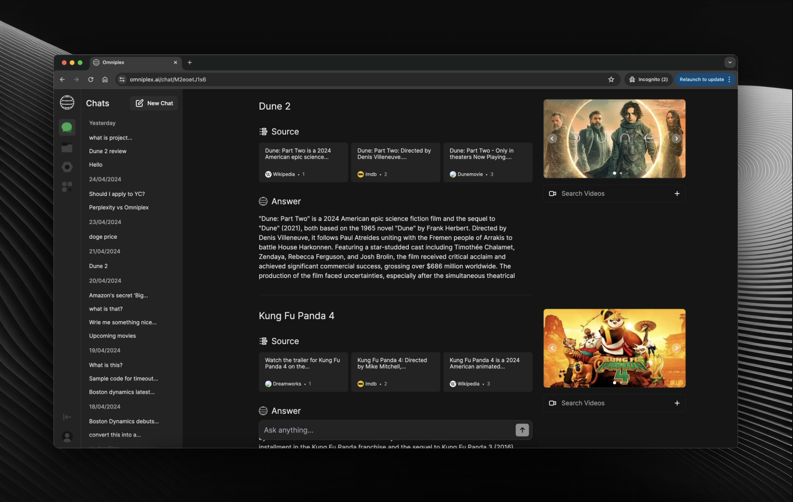

<p align="center">
	<h1 align="center"><b>Omniplex</b></h1>
<p align="center">
    Open-Source Perplexity
    <br />
    <br />
    <a href="https://omniplex.ai">Website</a>
    ·
    <a href="https://discord.gg/87Mh7q5ZSd">Discord</a>
    ·
    <a href="https://www.reddit.com/r/omniplex_ai">Reddit</a>
  </p>
</p>

2# Project README

## Table of Contents
- [Setup and Running Locally](#setup-and-running-locally)
- [Approach to Tasks](#approach-to-tasks)
- [Challenges and Solutions](#challenges-and-solutions)

---

## Setup and Running Locally

Follow these steps to set up and run the project on your local machine:

1. **Clone the Repository:**
   ```bash
   git clone https://github.com/SatadipIITG11/my-omniplex.git
   cd my-omniplex
   ```

2. **Install Dependencies:**
   Ensure you have the necessary package manager installed (e.g., npm for Node.js, yarn). Then run:
   ```bash
   <dependency-manager> install
   ```
   ```bash
   yarn
   ```

3. **Configure Environment Variables:**
   Create a `.env.local` file in the root directory and provide the necessary configuration values. For example:
   ```env.local
      BING_API_KEY=
      OPENAI_API_KEY=
      OPENWEATHERMAP_API_KEY=
      ALPHA_VANTAGE_API_KEY=
      FINNHUB_API_KEY=
      NEXT_PUBLIC_FIREBASE_API_KEY=
      NEXT_PUBLIC_FIREBASE_AUTH_DOMAIN=
      NEXT_PUBLIC_FIREBASE_PROJECT_ID=
      NEXT_PUBLIC_FIREBASE_STORAGE_BUCKET=
      NEXT_PUBLIC_FIREBASE_MESSAGING_SENDER_ID=
      NEXT_PUBLIC_FIREBASE_APP_ID=
      NEXT_PUBLIC_FIREBASE_MEASUREMENT_ID=
   ```

4. **Run the Application:**
   Start the project locally using the appropriate command:
   ```bash
   <start-command>
   ```
   
   ```bash
   yarn dev
   ```

5. **Access the Application:**
   Open your web browser and navigate to:
   ```
   http://localhost:<port>
   ```
   Replace `<port>` with the port specified in your configuration (default is usually 3000).

---

## Approach to Tasks

### 1. **Planning and Research:**
   - Defined project requirements and broke them into manageable tasks.
   - Researched best practices and tools relevant to the tasks. 
   - **I have integrated RapidAPI into the plugin section, creating two features:**
      Stock Details: Accessible via the /plugins/stocks route, this feature retrieves detailed stock information for various companies.
      Popular Movies: Available at the /plugins/movies route, this feature provides information about currently trending movies.


### 2. **Development Tools and AI Integration:**
   - **AI Tools Used:**
     - OpenAI's GPT for generating code snippets, documentation, and debugging suggestions.
     - Basically the main concept was to avoid redundant tasks by using ChatGpt.

   - **Development Process:**
     - Iterative development approach to ensure features were built incrementally.
     - Emphasized modularity and readability in code design.
---

## Challenges and Solutions

### 1. **Challenge:** Handling Complex Logic
   - **Problem:** Translating abstract requirements into efficient code.
   - **Solution:** Leveraged AI tools to generate initial code drafts, then iteratively refined them.

### 2. **Challenge:** Debugging Performance Issues
   - **Problem:** Slow response times in certain modules.
   - **Solution:** Used profiling tools to identify bottlenecks and refactored inefficient code paths.

### 2. **Challenge:** Finding rapid apis
   - **Problem:** Many rapid apis were paid So I have to explore a lot of free api which would suit the project
   - **Solution:** Got suggestions from LLM and discussions platform like reddit etc

---

Feel free to reach out for any additional clarifications or support regarding the project setup or functionality.
